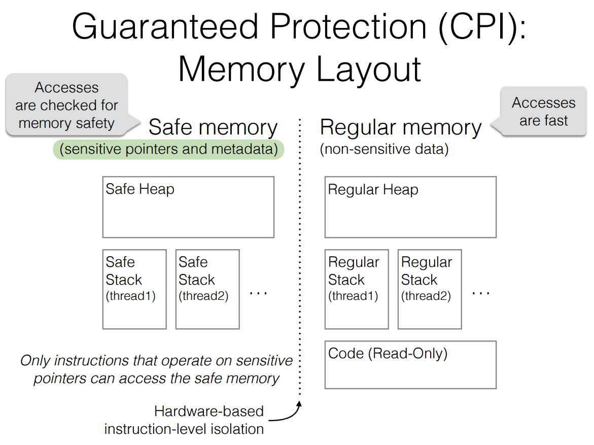
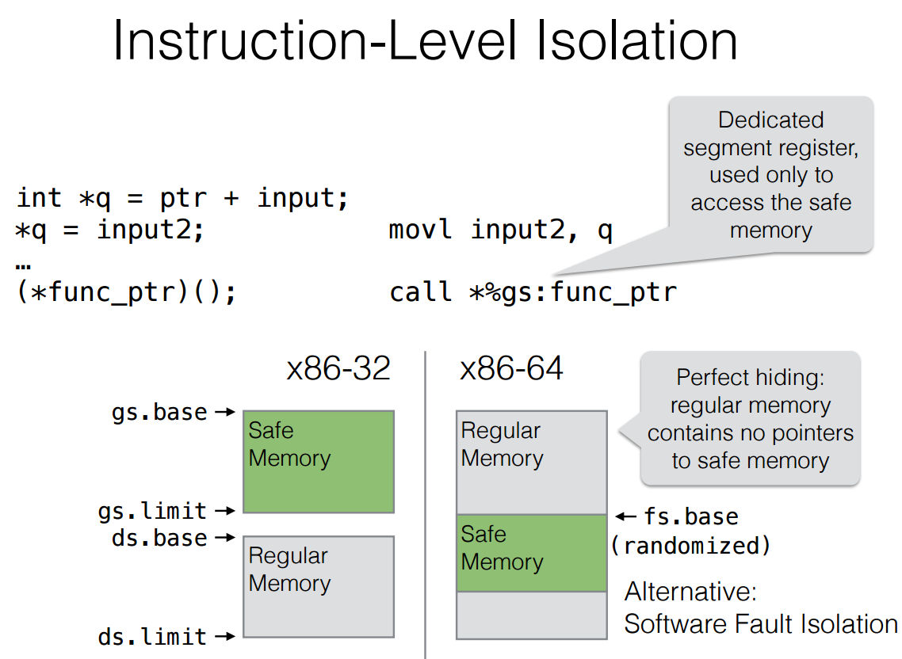

# Code Pointer Integrity (CPI)

原paper地址：[OSDI 2014](https://www.usenix.org/node/186160)。

### CPI Instrumentation

首先介绍喜爱Code Pointer Integrity (CPI)，CPI修改程序以达到：

1. 保证所有敏感指针都存储在安全区域。
2. 运行时创建并传播针对敏感指针的元数据
3. 在解引用敏感指针时检查元数据。

所有的加载或存储敏感指针的指令都会被替换成CPI指令用以保证加载或存储到了安全指针空间。理论上 **call** 和 **return** 指令也需要被改写，但是这里使用了安全栈来保护返回地址。每次解引用敏感指针都会在运行时检查元数据，结合上面的敏感指针保护，就能精确地保护所有的敏感指针。

对于泛型指针( `void *` 和 `char *` )，在安全区域和常规区域都存储一份，然后在运行时决定是否是安全指针是否需要进行保护。只有元数据认为是合法的时候才会将其存储或加载在安全区域，否则存储或加载在常规区域。

### 敏感指针

再说明下CPI保护的敏感指针，只有敏感指针才会该改变控制流，为了降低开销，CPI保护的仅仅是这一部分指针。为了判断敏感指针，作者制定了敏感类型，所有敏感类型的指针都是敏感指针。敏感包含了指向函数指针，指向敏感类型指针，指向组合类型指针，泛型指针(`void *`)。

这里符合**Make it fast, rather than general or powerful.** 原则，原本的保护方式是保护所有指针，确实能保证程序流正确性，却需要116%的开销，而CPI和CPS仅仅保护敏感指针，大大降低了开销。

### 隔离实现
CPI在 `x86-32` 和 `x86-64` 上的不同隔离实现。在 `x86-32` 上，使用硬件段保护，使用独立的段寄存器处理安全区域，保证了隔离性。在 `x86-64` 上，CPI基于以下事实，存储在常规区域的地址指针不会指向安全区域，选择其中一个寄存器存放安全区域的基地址就足够了。作者认为48位的地址空间足够使安全区域地址随机，以免被暴力破解，因为大多数错误的猜测会使程序崩溃，经常性的崩溃很容易被检测到程序被攻击了。

这里符合 **Handle normal and worst cases separately** 原则，将常规区域和安全区域隔离。常规区域作为normal case，不需要额外开销；而安全区域作为worst case，只占了所有程序中很小一部分，需要单独做额外操作并且在运行时做检查，将其隔离既保证了速度又保证了安全性。

### 安全栈

CPI对于安全栈做了特殊处理。因为安全栈会被经常调用，例如每个函数调用都会用到安全栈，为了降低开销和复杂性，安全栈特殊处理就很必要。这里基于了一个事实，大多数对栈上对象的安全性都可以在静态检查时检查出来，不需要动态运行时额外overhead。因此只有少部分需要创建额外栈上帧，保护了不被攻击。

这里也符合**Handle normal and worst cases separately**原则，安全栈的特殊处理分离了能被静态检查出来的和不确定的只能动态检查的对象，只对动态检查的对象有额外开销。同时符合**Use static analysis**原则，静态能检查出的不需要运行时高开销，降低了整体开销。

### CPS

CPS简单得说是弱化版本的CPI，敏感指针不再递归定义，只是单纯的代码指针。这种方法和CPI的区别是:

1. 只需要静态检查就能找到所有的敏感指针，无需额外的运行时动态检查。
2. CPS不需要任何元数据。指针值必须精确匹配目的地，所以 (被代码指针指向的) 控制流目的地无约束，不需要约束元数据。

CPS减少了安全区域的大小，加载和存储代码指针的内存处理数量。因此大大降低了开销。

CPS保证了：

1. 代码指针只能被代码指针存储指令存储或者修改。
2. 代码指针只能从前一个代码指针存储指令存储值的内存地址加载。

这里符合**Make it fast, rather than general or powerful.** 原则,进一步降低了保护的范围，但速度上有明显的提升，从CPI开销的8.4-10.5%降低到了CPS的0.5-1.9%

### 原则总结

CPI主要遵循了以下几条原则：

1. Make it fast, rather than general or powerful
2. Handle normal and worst cases separately
3. Use static analysis
4. Safety first

CPI保护了一部分指针，并针对这一部分进行单独的优化，保证了速度和安全性。静态分析完成了大部分的指针检测，使程序大部分的开销变低，只有少部分需要动态运行时检查。隔离的机制让安全性得到了保证。
