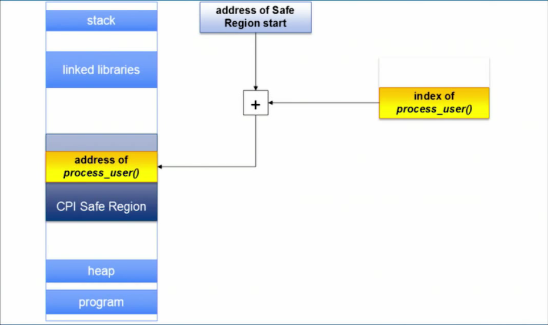

# Missing the Point(er)

原paper地址：[S&P 2015](http://www.ieee-security.org/TC/SP2015/program.html)。

###背景介绍
现今的服务器软件都被频繁爆出的漏洞所困扰，不论安全机制如何加强，黑客总能找到方法利用漏洞攻破服务器，例如现在常见的ROP攻击手段配合Data Disclosure漏洞，能攻破常见的DEP（数据段不可执行）、ASLR（地址空间随机化）防御。事实上自从70年代，类似buffer overflow的漏洞就已经被研究界发现，难道几十年的研究还无法开发出杜绝此类问题的技术吗，答案显然是否定的，使C/C++之类的语言具备内存安全性的成熟工具已经存在，能防止一切外界对程序内存的破坏，但运行开销太大，违背了工业界的设计原则之一**Make it fast, rather than general or powerful**，无法被广泛接受。几十年来，不断有开销低的保护技术被提出、被业界接受，但事实不断证明其只是增加了攻击的难度，还有新方法能进行攻击，例如现在热门的各类ROP变种攻击。在2014年的OSDI会议上发表的CPI技术看似解决了这一两难问题，在低开销的情况下提供了非常强的保护，但本文提出了一种攻击，可以攻破其防御，说明其基于信息隐藏的实现存在安全隐患，需要换成Software Fault Isolation的解决方案，势必导致开销增大，说明性能和安全性的两难问题还远远没有解决，这场攻击者和防御者的战争还将继续。

###CPI及其漏洞
####CPI防御技术
CPI(Code Pointer Isolation)是一种将函数指针及指向函数指针的指针（称为敏感指针/Sensitive Pointer）保护起来，从而防止攻击者篡改控制流的防护手段，如图所示：

敏感指针的值被存储在Safe Region中，通过静态分析和二进制修改，保证程序中没有指针指向该Safe Region，从而保护了敏感指针，当需要访问敏感指针时利用其中存储的Index和Safe Region的基地址即可获取被保护的值。

####CPI的漏洞
在CPI的论文中，通过形式化证明的方式论证了它能提供对控制流劫持攻击100%的防御，这一点比细粒度的CFI更强，但这要建立在作者的假设之上，即被保护在Safe Region内的敏感指针是安全的，不会被攻击者修改。

在`x86-32`架构上， 由于具有段式内存管理这种硬件级别的内存隔离机制，这一点是可以保证的，但在`x86-64`和`ARM`架构上，则必须通过软件方式实现Safe Region的保护。在CPI的原型实现中，使用的是地址随机化技术，类似于ASLR，将Safe Region的基地址随机化，以防止攻击者修改Safe Region的内容。这是一种基于信息隐藏的保护手段，并不能从根本上阻止攻击者的进攻，作者在实现原型系统时进行了错误的假设：
- 其一，ASLR技术被攻破，常是因为内存内容被泄露，而CPI保护的程序中没有指针指向Safe Region，因此作者认为即使出现了会泄露内存内容的bug，也不会直接泄露Safe Region的内容，攻击者只能随机猜测Safe Region的基地址进行盲目的覆盖。事实上，目前最新的时间侧信道攻击可以以很高的准确率获知被攻击程序任意内存地址的内容，自然也可以获取Safe Region的内容并据此推测出Safe Region的基地址。
- 其二，作者认为由于目前普遍采用的48位地址空间极大，攻击者若要猜测Safe Region的位置进行攻击（不论是读取还是修改），都势必引起大量崩溃，这样明显的异常行为可以通过检查机制轻易检测到。事实上，在作者原型实现中其中一种实现——线性表（即一级查询）上，甚至可以进行不引起崩溃的攻击，这主要是由于其信息隐藏机制提供的信息熵（攻击者需要猜测的次数）不足。

CPI在原则上的设计是值得肯定的，但是在其第一个原型系统的具体实现上，违背了**Get it right, neither abstraction nor simplicity is a substitute for getting it right**的设计原则，过于追求简单，导致没有为Safe Region提供足够的保护。在这样的实现下测出的开销，相比于真正安全的可以用于生产环境的系统的开销，显然还有所低估。

###攻击手段

###结论

