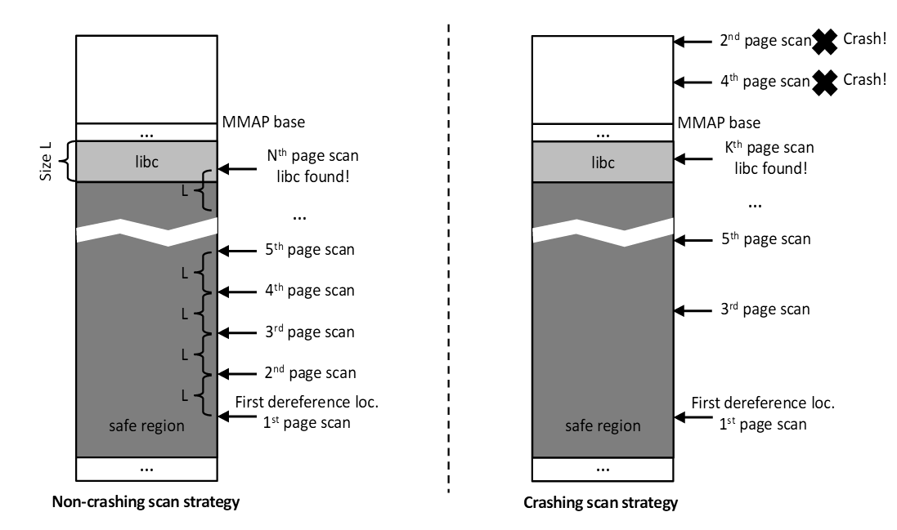

# Missing the Point(er)

原paper地址：[S&P 2015](http://www.ieee-security.org/TC/SP2015/program.html)。

### 背景介绍
现今的服务器软件都被频繁爆出的漏洞所困扰，不论安全机制如何加强，黑客总能找到方法利用漏洞攻破服务器，例如现在常见的ROP攻击手段配合Memory Disclosure漏洞（由被攻击程序通过输出使攻击者直接读取内存内容），能攻破常见的DEP（数据段不可执行）、ASLR（地址空间随机化）防御。事实上自从70年代，类似buffer overflow的漏洞就已经被研究界发现，难道几十年的研究还无法开发出杜绝此类问题的技术吗，答案显然是否定的，使C/C++之类的语言具备内存安全性的成熟工具已经存在，能防止一切外界对程序内存的破坏，但运行开销太大，违背了工业界的设计原则之一**Make it fast, rather than general or powerful**，无法被广泛接受。几十年来，不断有开销低的保护技术被提出、被业界接受，但事实不断证明其只是增加了攻击的难度，还有新方法能进行攻击，例如现在热门的各类ROP变种攻击。在2014年的OSDI会议上发表的CPI技术看似解决了这一两难问题，在低开销的情况下提供了非常强的保护，但本文提出了一种攻击，可以攻破其防御，说明其基于信息隐藏的实现存在安全隐患，需要换成Software Fault Isolation的解决方案，势必导致开销增大，说明性能和安全性的两难问题还远远没有解决，这场攻击者和防御者的战争还将继续。

### CPI及其漏洞
#### CPI防御技术
CPI(Code Pointer Isolation)是一种将函数指针及指向函数指针的指针（称为敏感指针/Sensitive Pointer）保护起来，从而防止攻击者篡改控制流的防护手段，如图所示：

敏感指针的值被存储在Safe Region中，通过静态分析和二进制修改，保证程序中没有指针指向该Safe Region，从而保护了敏感指针，当需要访问敏感指针时利用其中存储的Index和Safe Region的基地址即可获取被保护的值。

#### CPI的漏洞
在CPI的论文中，通过形式化证明的方式论证了它能提供对控制流劫持攻击100%的防御，这一点比细粒度的CFI更强，但这要建立在作者的假设之上，即被保护在Safe Region内的敏感指针是安全的，不会被攻击者修改。

在`x86-32`架构上， 由于具有段式内存管理这种硬件级别的内存隔离机制，这一点是可以保证的，但在`x86-64`和`ARM`架构上，则必须通过软件方式实现Safe Region的保护。在CPI的原型实现中，使用的是地址随机化技术，类似于ASLR，将Safe Region的基地址随机化，以防止攻击者修改Safe Region的内容。这是一种基于信息隐藏的保护手段，并不能从根本上阻止攻击者的进攻，作者在实现原型系统时进行了错误的假设：
- 其一，ASLR技术被攻破，常是因为内存内容被泄露，而CPI保护的程序中没有指针指向Safe Region，因此作者认为即使出现了会泄露内存内容的bug，也不会直接泄露Safe Region的内容，攻击者只能随机猜测Safe Region的基地址进行盲目的覆盖。事实上，目前最新的时间侧信道攻击，可以在不需要Memory Disclosure的情况下以很高的准确率获知被攻击程序任意内存地址的内容，自然也可以获取Safe Region的内容并据此推测出Safe Region的基地址。
- 其二，作者认为由于目前普遍采用的48位地址空间极大，攻击者若要猜测Safe Region的位置进行攻击（不论是读取还是修改），都势必引起大量崩溃，这样明显的异常行为可以通过检查机制轻易检测到。事实上，在作者原型实现中其中一种实现——线性表（即一级查询）上，甚至可以进行不引起崩溃的攻击，这主要是由于其信息隐藏机制提供的信息熵（攻击者需要猜测的次数）不足。

CPI在原则上的设计是值得肯定的，但是在其第一个原型系统的具体实现上，违背了**Get it right, neither abstraction nor simplicity is a substitute for getting it right**的设计原则，过于追求简单，导致没有为Safe Region提供足够的保护。在这样的实现下测出的开销，相比于真正安全的可以用于生产环境的系统的开销，显然还有所低估。

### 攻击手法
#### 时间侧信道攻击
14年的CCS会议上一篇论文提出了一种新的侧信道攻击，用于在没有Memory Disclosure漏洞的情况下读取内存内容，其基本思想如下：
```c
int i = 0;
while (i < ptr->value) {
  i++;
  doSomeWork();
}
```
假设指针`ptr`可以被一个漏洞修改，则通过修改该指针，可以造成上述循环执行时间发生变化。通过测量并统计不同内存地址对应的不同时间，可以推测出内存地址上存储的值，根据论文，只要采样次数够多，获得的结果将是较为精确的。

尽管由于CPI的保护，程序不太可能产生直接泄露Safe Region内容的Memory Disclosure漏洞，但上述攻击只需要一个内存覆盖漏洞，是普遍存在的，因此可以借此攻破CPI的防御。

#### 定位Safe Region
我们需要上一节的攻击，是因为我们需要定位Safe Region的基地址，因此势必通过读取一些Safe Region的内容来推断其基地址（程序普通空间内没有相关信息）。

第一步，找到一个合法的内存地址，位于Safe Region内。在目前初版的CPI中使用的是OS提供的ASLR功能，随机浮动范围为2^40字节（28位随机+4K页对齐），而Safe Region本身在使用线性表的情况下占据2^42字节，因此我们甚至可以找到一个地址，使得其必在Safe Region内。

第二步，找到libc，并获知libc的基地址。因为目前的实现中，Safe Region和动态链接库在内存布局上是紧挨着的，无法分辨Safe Region的边界，故需要通过定位到libc，来反过来定位Safe Region的位置。这一步有两种做法：

1. 非崩溃式扫描
2. 崩溃式扫描


如图所示，其扫描方式如下：

- 非崩溃式扫描，每次移动一个libc的大小，直到进入libc范围内，则不会引起崩溃，问题的关键是确定目前的地址是否在libc内。由于Safe Region是大而稀疏的，其中大部分内容都为0，故可以通过上一节的侧信道攻击获取目前地址上的内容，来判断是否在libc内，内容为零则代表在Safe Region中。由于只需比较是否为零，该攻击的不准确性并不会造成影响，只需每个字节采样约30次即可，共需2字节的Signature加上额外的5字节防止误判。在此情况下，libc大小约为2^21字节，故共需最多(2+5)\*2^40/2^21\*30=**110,100,480**次采样，上亿次的采样使得非崩溃式扫描耗时甚巨，在实验中花费了**97小时**才定位到libc的位置。此外，进入libc后还要读取其内容来确定目前在libc中的位置，从而反推出libc的基地址以及Safe Region的基地址，这一步要求的读取精度很高，每个字节需要采样一万次，共需采样70个字节才能保证能模糊匹配到当前位置，这额外的70万次采样使得总的攻击时间达到了**98小时**。

- 崩溃式扫描，为了减少攻击时间，可以采取二分搜索的方式寻找libc。由于动态链接库旁边即是不可访问的内存，且已知其地址空间可能的起点范围，我们可以在这2^40字节的空间中对可用的动态链接库内存和不可访问内存的分界点进行二分搜索，这最多只会引起19次崩溃，我们还可以让最后几次搜索采用非崩溃的方式来减少这一数目。此外，在获取当前在libc中的具体位置时，也采用另一种方式，从当前位置开始线性搜索，直到产生崩溃为止，说明来到了libc中的不可读取的节，据此可反推出libc的基地址。这种攻击可以在**6秒内**完成，共会引起十余次崩溃。

第三步，攻击Safe Region。至此，已经得到了Safe Region的基地址，我们还需要一个任意内存地址覆盖的漏洞，修改我们想要修改的函数指针在Safe Region内的项，去除其限制。随后，我们就可以发动ROP攻击，任意调用我们想要调用的函数而不受CPI的限制。

### 结论

