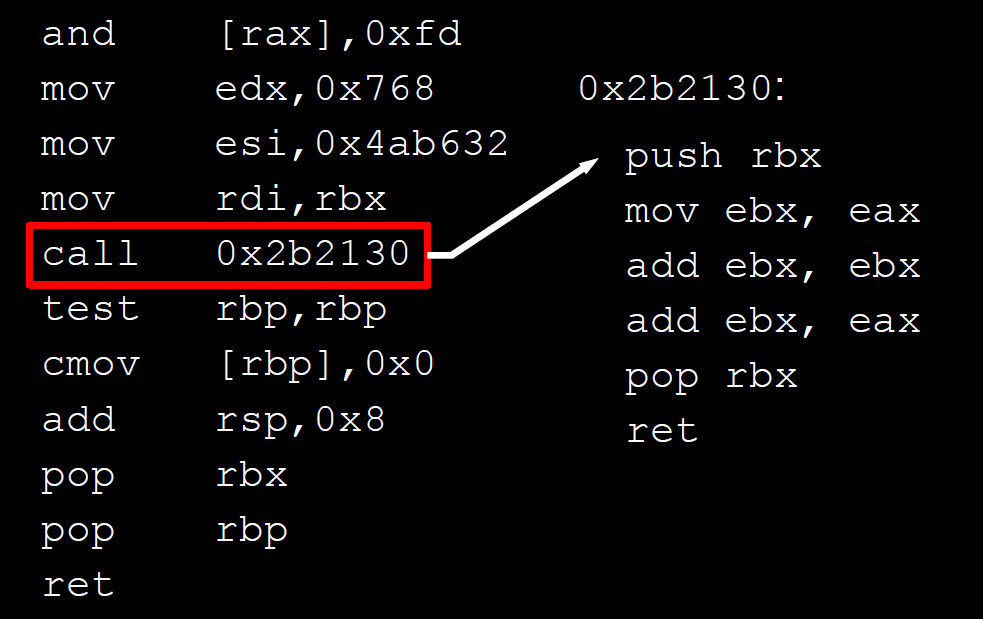

# ROP is still dangerous

原paper地址：[USENIX Security 2014](https://www.usenix.org/conference/usenixsecurity14/technical-sessions/presentation/carlini)。

**名词定义：**

* gadget: 以 `ret` 结尾，指令数小于20 的汇编指令串
* long sequence: 8个以上的连续执行的gadget

## 三种全新的ROP攻击方式

本文介绍了三种方式可以突破现在主流的ROP防御的方法。

### 1. Call-Preceded ROP

通常来说，在一个正常结构（没有ROP漏洞）的程序中，每一个 `ret` 指令都必须回到一个紧跟着一个 `call` 指令的地方。

如果 `0x2b130` 处的代码正常执行，那么 `ret` 肯定会回到 `test rbp, rbp` 这一句指令，这句指令肯定紧跟在 `call 0x2b130` 指令后。




ROP是利用现有代码重新组合从而实现攻击，所以肯定存在不符合Call-Preceded原则的跳转代码片段。所以一般的ROP防御都会检查是否每一条 `ret` 指令都紧跟着 `call` 指令。

Call-Preceded ROP是作者提出的可以不违反这一原则的情况下仍然可以实现ROP攻击的方法。

核心的思想，我们需要让gadgets变得更加复杂，让gadget变得相对长，包含直接跳转和间接跳转，可以增加可用的gadget，让跳转的位置可以找到的call-preceded的指令。

### 2. Evasion Attacks

#### ROP防御原理 Classification-based defenses

这部分的ROP防御是runtime实时监查程序的执行，来区分程序的执行的指令是还是 normal execution 还是 gadget。

那么现在很多的ROP攻击就是通过组合多个gadget形成一个 **long sequence**，一种length-based classifier就可以通过检查执行时指令的长度，如果出现了 **long sequence** ，可以把执行流按照间接跳转（ `ret` ，间接 `jmp` ）拆分成多个只包含基本指令的指令片段，如果这些指令片段都是比较短的，并且在一个窗口周期内，出现了大量的短的片段，那么这类的防御就把他们判断成 **long sequence of gadgets** ，算作是ROP攻击。

#### Using gadgets that look like benign execution

Evasion Attacks当然是要把把包含ROP攻击的gadget伪装成正常的执行指令串，就针对length-based classifier这种防御来说，只需要把ROP攻击的gadget长短结合，就可以避免被检查出来。

其他的ROP方式如果也是从normal execution和gadget的区别来防御的，也是可以设计出Evasion Attack的方法的。

### 3. History Flushing

#### 原理介绍

一部分防御方法是会维持一定量的指令执行的历史，并且会隔一段时间检查执行流。

History Flushing就是通过不断刷掉ROP attack的历史信息，给检查历史执行流的ROP防御程序一个假象，就可以实现ROP攻击。

#### 攻击方法

给程序中加入很多有效的 `no-op` 指令，这样防御者就看不到任何ROP的信息。比如 _kBouncer_（一种基于此原理的防御ROP设计，后文详细介绍）使用的就是 **the Last Branch Record** ，是一种报告最近16个记录的硬件机制。那么只要加入16个无关的 `indirect jmp` ，就可以绕过 _kBouncer_ 的防御。

## Defeating kBouncer

### kBouncer的原理

_kBouncer_ 使用了 `LBR` ，检查最近的16个调用system call的分支。同时， _kBouncer_ 有两个检查机制：
* 检查 `LBR` 中每一个 `ret` 指令的返回地址是call-preceded地址
* 检查了最近的8个间接跳转分支，如果是类似于gadget的，整个进程就会被当做ROP攻击而kill掉。

在传统ROP的基础上，作者使用了history flushing清除了 `LBR` 中的ROP攻击的证据，之后使用了evasion attack和一些专门设计的gadgets来调用syscall。


### 具体的细节

#### 1. Initial exploitation

在这个阶段贮备好system call的所有参数并把它们保存在可以非常简单恢复的位置。

#### 2. Hide the history

**第一部分Hiding history through LBR flushing**

* A short flushing gadget: 简单的call-preceded的以ret结束的gadget，不修改所有的寄存器
* A long termination gadget: 超过20个指令，长度长到让kBouncer检查的时候认为不是gadget的call-preceded gadget


首先，重复使用flushing gadget来填满 `LBR` 里16个记录，从而清除了其他的记录。尽管这个时候 `LBR` 里已经没有其他ROP攻击的记录，但这个时候如果直接调用system call，仍然是不行的，因为 `LBR` 所有的entry还都是被检测出是gadget的，这样仍然会被认为是一个ROP攻击。

下一步，就需要使用termination gadget。这样，可以把 `LBR` 中至少8个entry中的gadget的长度超过了20，可以说，termination gadget是用来让 _kBouncer_ 无法找到gadget-like的指令串。至于termination gadget之后的寄存器的状态是没有什么要求的，唯一的要求，就是在termination gadget执行后，我们仍然有指令流的控制权，可以说这个要求也是比较简单的。对于termination gadget，具体做的时候，还需要保证紧跟着termination gadget的一个没有问题、不进行攻击的指令集，同时要保证其中的指令操作不会修改memory和register。

**第二部分Hiding history through context switching**

由于LBR是在线程间共享的，所有还有一个简单的flush掉LBR的方法就是利用content switch。我们只要找到很多类似于下图的片段就可以轻松地用来flush `LBR`。

```
4a833dd4  dec   ecx
4a833dd5  fmul  [4A88BBC8h]
4a833ddb  jne   [4A833DD4]
```

只要另一个线程修改了 `LBR` ，那么原来一个线程在 `LBR` 里的疑似ROP攻击的证据就会被消除，这个方法非常有效。

#### 3. Restoring Registers with Returns

这一步就在调用system call之前是把寄存器的值存好，使用的gadget也要是call-preceded的，并且长度比8短就行。这一步也是比较简单的，因为 `x86` 的汇编代码一般都会有大量的 `push` 和 `pop` 寄存器的操作。

#### 4. Restoring Registers without Returns

有以下四种方法可以存储register

1. ROP without return instructions.
2. Jump Oriented Programming (JOP).
3. Using Non-Call-Preceded Gadgets
4. Call Oriented Programming (COP).

#### 5. Issuing the System Call

最后一步就是调用system call。
在这里我们不能直接让执行 `return` 直接到想要去的函数的开始的地方（比如mprotect, VirtualProtect），因为那样不是call-preceded的。
有三种方法可以解决

1. reflector gadget：这是一个以寄存器的值进行间接跳转的指令结尾的gadget。这样就可以是的寄存器的值指向想要调用的函数
2. 直接找到一个call指令，指向desired function，比如下面的代码
3. 有的时候，可以回到一个desired function的中间，利用偏移量来，这样也就是call-preceded了，比如下图的  `<execv+18>`。

```
<excve>:
    push    rbp
    mov     rbp, rsp
    push    r14
    push    rbx
    mov     r14, rsi
    mov     rbx, rdi
    call    _NGGetEnviron
    mov     rdx, [rax]
    mov     rdi, rbx
    mov     rsi, r14
    call    execve
    mov     eax, -1
    pop     rbx
    pop     r14
    pop     rbq
    ret
```

## Defeating ROPecker

_ROPecker_ 原理参考[ROP-checker](./ROPecker.md)。

对ROP的攻击被称为 **Repeated history hiding attack**


攻击有几个阶段

1. Initialization: 插入一段termination gadget，让 _ROPecker_ 对 `LBR` 中gadget数量的监测失效。
2. Loading Phase: 首先把一个useful page载入executable set，这个page上的所有gadget都会立刻被preceded并且跟随一个termination gadget。当page fault发生的时候， _ROPecker_ 会检查 `LBR` ，如果他往后检查就会发现每个page跟随的termination gadget，如果向前，就会找到最开始加入的那个，所以就限制了 _ROPecker_ 对于page load gadget的数量的控制。
3. Attack Phase: 在useful page被载入进来之后就可以开始部署攻击了。因为之前的工作，所以useful page上的攻击是不会被发现的，并且重复以上三个阶段，就可以在多次攻击中完成攻击者最终想要做的攻击，这样使得每一次攻击的难度没那么大。
4. History Hiding: 最后，像对付 _kBouncer_ 一样，只需要flush掉 `LBR` 里的记录，就可以在下次 _ROPecker_ 正常工作之后，也不会被发现有ROP攻击。
5. Segmenting the Attack Payload: 由于要分段进行ROP攻击，所以需要合理地在每个page上放置有限数量的gadget。
6. Selecting Pages to Load: 由于executable set只能存有限量的page，最简单实用的方法就是每次从一个页上载入一个gadget，并且只载入一次。
当然，也可以在操作得当的情况下，载入一个有多个useful gadget的页，这样即使 _ROPecker_ 的executable set只有一两页，也是可以实现攻击的。

## 结论

本文提出了三种攻击的思路，并且成功地攻陷了 _kBouncer_ 和 _ROPecker_。

作者发现了前人没有注意到的两个重点

1. ROP攻击是可以只含有很短的gadget的
2. ROP攻击可以都是call-preceded的

对于未来的ROP防御的研究，作者认为，防御不能只关注程序执行过程中的一部分历史，因为这样是肯定可以被攻击者通过其他方法给消除攻击证据的，ROP的防御必须针对所有ROP的特点，因为特定的防御方法都会有特定的evasion attack。

**ROP的防御必须着眼于正常执行和ROP攻击执行的最基本的差别。**
