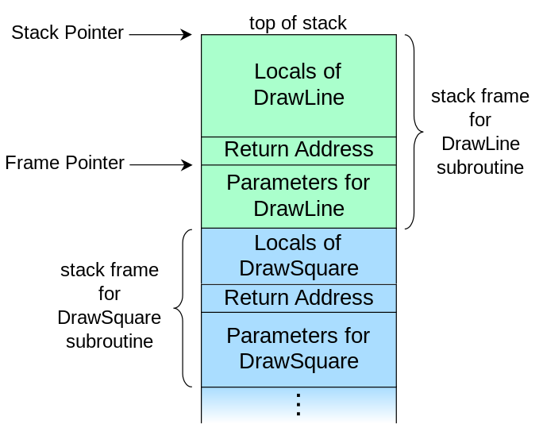

# 什么是ROP

高级语言的代码通过编译器编译成各个平台 (`x86`, `x86-64`, `ARM`等) 上的汇编代码，计算机获取汇编代码并通过CPU执行这些指令从而运行程序。假如对一段发布的二进制程序，能够人为的修改其汇编指令，也就修改了程序的执行效果，这样的修改统称为**二进制攻击**。

举一个例子，比如泛滥在中国网络上的xx软件破解版，比较简单的验证软件是否激活的实现，从汇编的层面来看也许就是一个条件`jmp`指令，对二进制程序进行修改改变跳转条件，软件就被破解了。或许只需要改一两个byte，因此早期的软件破解其实非常容易。

常见的二进制攻击包括栈溢出 (stackoverflow)，堆溢出 (heapoverflow)，格式化字符串攻击，劫持程序的控制流，控制PC指针从而控制程序的执行。但现代的系统会有多种机制防止这些攻击，例如DEP (堆栈不可执行)，ASLR (内存地址随机化) 等机制阻止攻击者插入并执行恶意指令，俗话说“道高一尺，魔高一丈”，二进制攻击的技巧也越来越丰富。ROP攻击，在劫持控制流后，通过反复执行内存中已加载的可执行的指令 (俗称gadget)，这些gadget段以`ret`指令返回劫持的控制流中，攻击者利用gadget拼接组合出想要执行的代码，

下图是通常的内存栈的layout。

关于 ROP 的实际入侵样例，可以参考[一步一步学ROP之linux_x86篇](http://drops.wooyun.org/tips/6597)，[一步一步学ROP之Android ARM 32位篇](http://drops.wooyun.org/papers/11390)。
